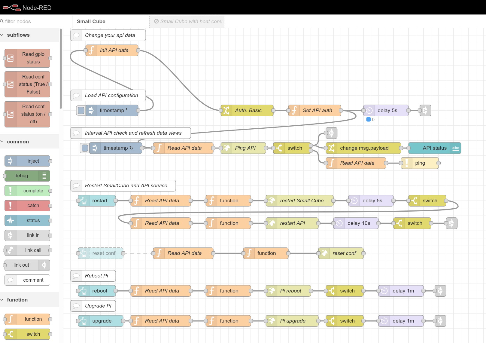

Small Cube is an API application for the Raspberry Pi to manage the turning on and off of gpio pins at certain times of
the day. It also allows you to run various scripts and plugins by scheduler.

Application management is done via API. For testing purposes, I developed a gui based on Node-RED, which is fully
functional.

The application has been tested and is used on a Raspberry Pi Model A Rev 2 with Raspbian GNU / Linux 10 installed. It
should also run on 11.

Flows:

Dashboard Home:

INSTALLATION Small Cube

Default user is "pi".

Steps:

1. sudo apt update && apt -y upgrade
2. sudo apt install nginx git
3. cd /opt && sudo mkdir SmallCube
4. sudo chmod pi:pi SmallCube
5. cd SmallCube
6. git clone https://github.com/noxgle/smallcube.git
7. ./createVirtEnv.bash
8. cd install && ./install_service.bash
9. cd ../ && cat conn_app.txt

Test if all is working: venv/bin/python api_test.py

CONFIGURATION Node-RED

Copy all data from conn_app.txt, will be needed for Node-RED to connect. You can install node Node-RED on a raspberry pi
or on your laptop. You can also use home assistants with Node-RED installed. Next, we import a file called sc.json
from the node-red application directory. Go to the tab flow "Small Cube" and change your api data in function "Init API
data". Push button "DEPLOY" and now you can open gui to start configuration process.

GPIO Default gpio mode is board.

steps:

- enable modules in gui on tab: "Main Conf" -> "Enable gpio module"
- enable gpio and set it to OUT in tab: "Gpio Conf"
- find in flow "Change gpio low/high on pin 11" and change in function "set pin number" pin that you are using

Now you can enable or disable by hand or use scheduler fot that pin.

SCRIPT

Enable gpio and set it to OUT in tab: "Enable script module". Upload your script to folder called "scripts". Your script
should look like this: "scriptname.script". Now you can use your script in scheduler.

PLUGIN

Enable gpio and set it to OUT in tab: "Enable plugin module". Upload your plugin to folder called "plugins". An example
plugin is named "example" and you can use it as a skeleton.

HowTo
1. Reset configuration to default? In Small Cube folder delete file called db, then restart service or pi. 

Shorten links with: https://lvk.pl
